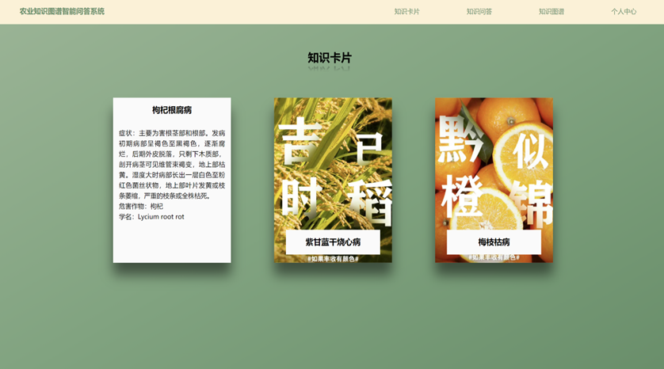
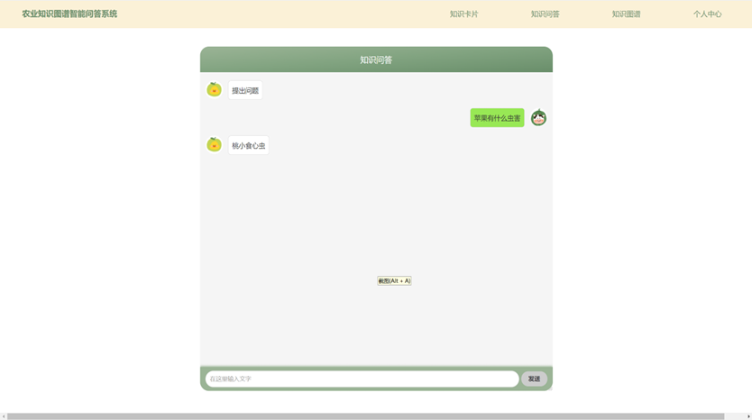
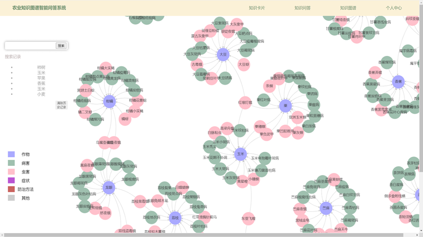
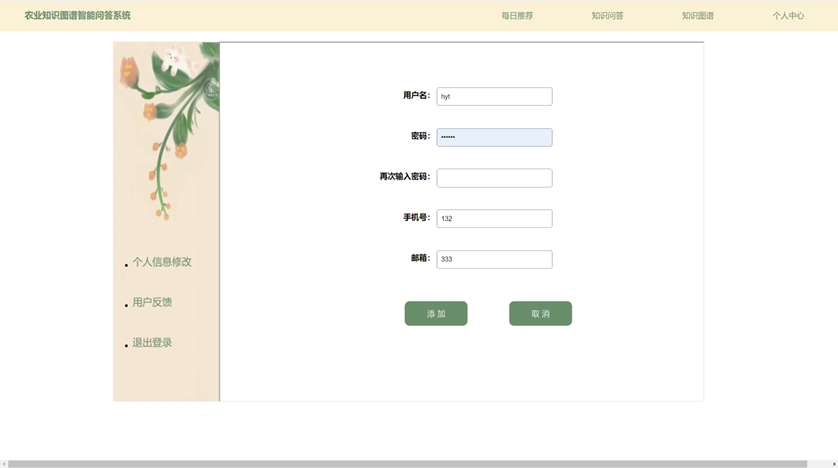

# 基于农业知识图谱的智能问答系统

知识卡片展示（基于知识图谱，获取图谱数据形成知识卡片）

|–随机展示：每次进入界面随机生成一张知识卡片，展示病虫害的相关知识

问答系统（基于深度学习模型，识别用户问题，在图谱中获取答案并展示）

|–输入问题：用户在搜索框里输入问题

|–意图识别：基于深度学习技术，识别用户意图

|–知识图谱检索：通过用户意图在知识图谱中搜索相关信息，获取答案

|–文字展示：以文字对话的形式展示答案，方便用户直接阅读获取的信息

图谱展示（基于知识图谱和echarts展示结点数据）

|–图谱展示：将从知识图谱中具体节点以图谱的方式展示在界面上

|–查看历史记录：通过本地缓存存放历史记录，展示用户搜索过的节点

个人中心

|–登陆：通过用户名和密码进行登录

|–注册：用户在注册页面输入用户名和密码以及用户手机号

|–帮助反馈：用户点击反馈按钮，提交具体反馈信息

|–个人信息设置：用户登陆成功后，可以进入个人信息设置页面设置手机号邮箱等

